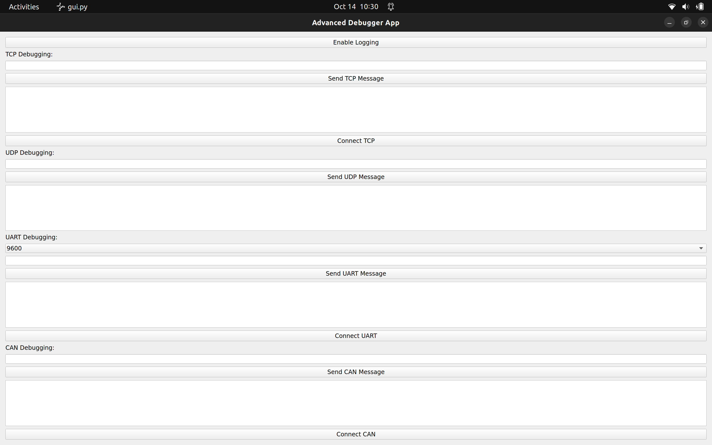

# Advanced Debugger App

This application is used for debugging and monitoring communication protocols such as **TCP**, **UDP**, **UART**, **CAN**, etc.

## Prerequisites

Install the following dependencies:

```bash
sudo apt update
sudo apt install python3-pyqt5 python3-serial python3-pip can-utils
pip3 install python-can pyqt5
```

---

### How to Run the Application
1. Download or clone this repository.
2. Open a terminal and navigate to the application folder.
3. Run the application with the command:

```bash
python3 debugger_app.py
```

### Features
TCP: Send and receive messages through a TCP connection.
UDP: Send and receive messages using UDP.
UART: Communicate with serial devices via UART port.
CAN: Connect and send messages over a CAN network.

### Troubleshooting
Ensure all devices are connected properly.
Check the IP, port, and baud rate configurations according to your devices.

